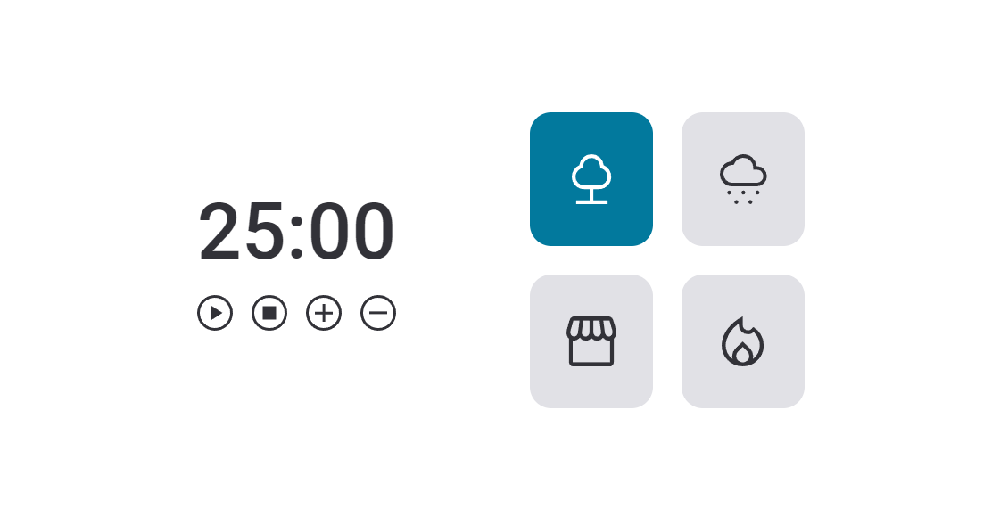

# Explorer - Stage 05: FocusTimer 2.0

> A timer with background sounds

This was the first challenge of Stage 05 from my Web Development course, using HTML, CSS, and JavaScript.

### I created a timer for studying purposes, with the following features:

- Buttons with play and pause functions
- Buttons to add and remove 5 minutes from the timer
- 4 background sounds options

### I also added a few other extras features outside the challenge:

- An alarm sound when the counter gets to 0
- The stop button sets thet timer value to its initial state

### Other details:

- The layout was based on a Figma design.

- It's a responsive layout with different mobile and desktop versions.

- [Click here to view it live!](https://jessicaranft.github.io/explorer-Stage05-FocusTimer/)

---

Main elements used in each language:

## CSS

- Variables
- Reponsivity with clamp() and @media
- Grid and flex

## Javascript

- Functions
- Play, pause and audio controls
- ES6 Modules
- Factory and dependency injection
- Events and callbacks

---

Software: Visual Studio Code
